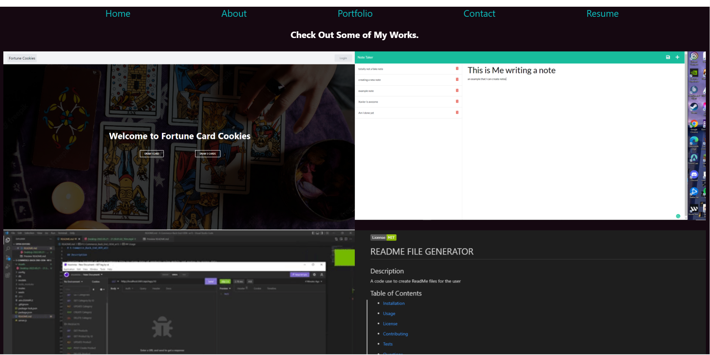
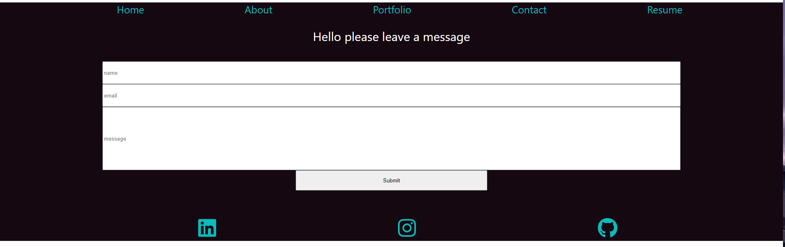
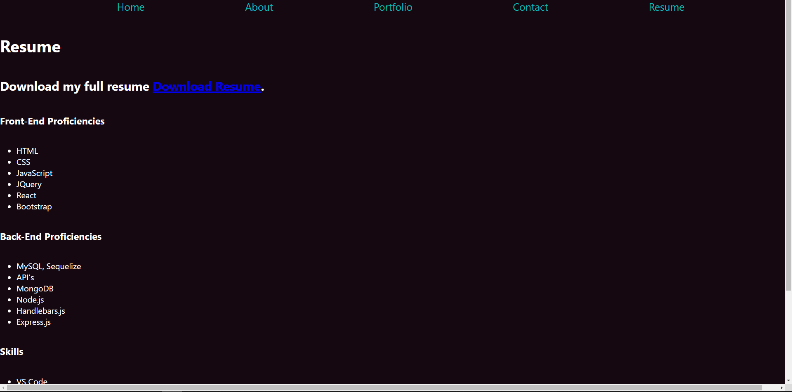

# W20-MyReact-Profile

## Description

A WebProfile for myself using React to help with job finding.

## Table of Contents

- [Description](#description)
- [Instillation](#instillation)
- [Usage](#usage)
- [Contribution](#contribution)
- [Tests](#tests)
- [Questions](#questions)

## Instillation

There is no Istallation for this just run 'npm start'

## Usage

the Help employeers see my work as well as see what i am capable of using React

## Contribution

There are no contribution guidelines for this project

## Tests

There are no tests for this application

## Liscense

there was not need for a Liscnese on this project

https://unlicense.org/

## Questions

If you have any further questions contact me here:

Email: xavier.ray.marquez@gmail.com

github: [XavierMarqez](https://github.com/XavierReyMarquez)
